# ***Data-Cleaning In Excel***

Demonstrating data cleaning using Excel using US Debt Tracker Excel filt. This file has data reaching from 1993-2022.

### ***Project Overview***

This project will demonstrate my ability to manipulate and clean a dataset in excel into usable information for a series of charts and graphs. I will be working with a dataset named US Debt Tracker Project Excel file. I will need to go through a series of edits such as transposing and formatting to transform it into a useable dataset.

### ***Tools***

-  Microsoft Excel

### ***Goals***

- Show an understanding of pest practices in establishing a control dataset prior to manipulating the data.

- Show an understanding of manipulating data by transposing the data, and cleaning data.

- Show an understanding of creating data using information from the dataset.

## ***Importing Data***

The first step is to make sure that I keep the integrity of the original dataset. I do this by creating a second sheet and copying the data over to the new Excel sheet. This way I will have the original information if I need to reference something or if I make an edit only to realize I needed to keep the information I may have removed or changed.

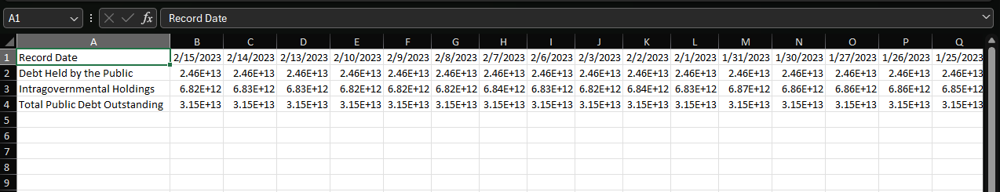

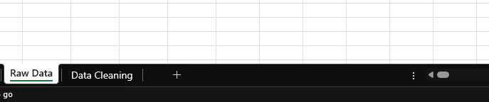

The second step I want to take is to change the positioning of data. The current layout of the data would make working with it difficult to work with. To make the process smoother and information easier to understand I will transpose the data. This process changes the information that is in the columns and rows switch positioning.

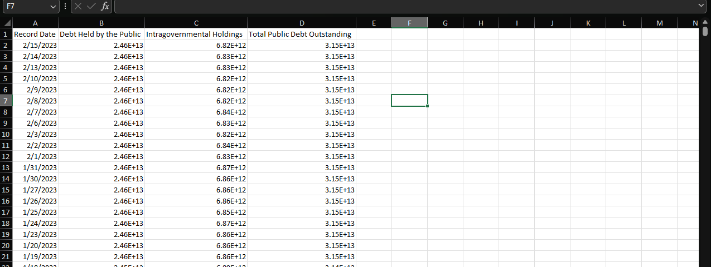

Next step, I want to add a filter to the data so when I start to explore to start the cleaning process, I can more easily find what I am looking for such as blanks or misspellings or information errors.

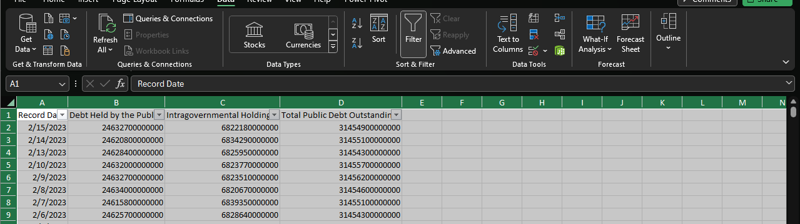

Going through the filter we find that there are several nulls. The cells with null written in them as text. This can affect any outcome of information we may want from the dataset.

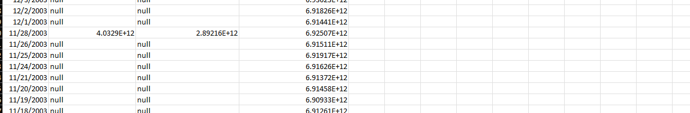

To remove the null, I want to use Find and Replace to remove null from all the cells.

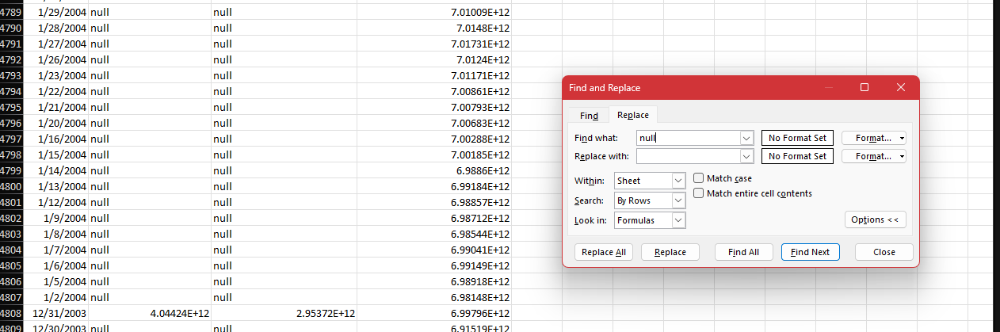

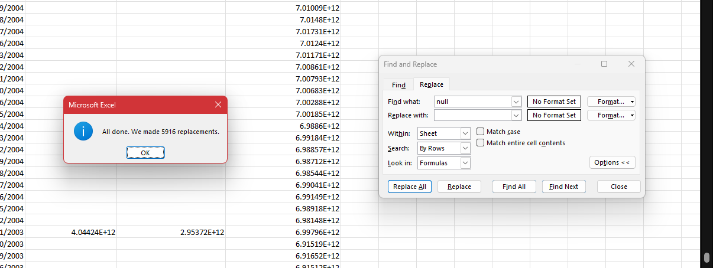

After transposing and adding filters to the columns and removing the nulls. I want to update the format of the numbers in the dataset. The amount of debt for the information is set into scientific formatting. This saves space and gives us a shorter looking number. However, this could make doing calculations difficult. To fix this I changed the format from scientific to numbers.

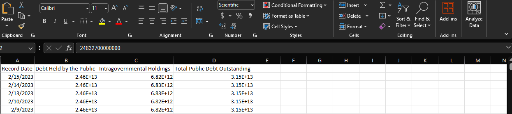

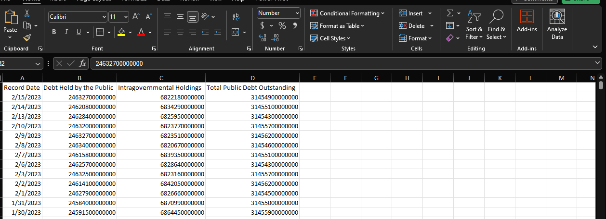

The data seems to be ready to start making things such as charts and graphs to relay information. With this dataset we could investigate debt by year increase and compare the year to the previous year’s debt. To see thing information, we will use a pivot table and graphs. Looking at the data it seems that the information we would want to use is already in the data listed at the end of each year.

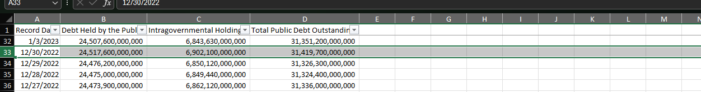

This dataset goes from 1993 – 2022. This gives us a large range to work with when exploring the information to compare the yearly debt totals to each year. To get the information isolated I used the filter tab and only selected the data from the last day of each year.

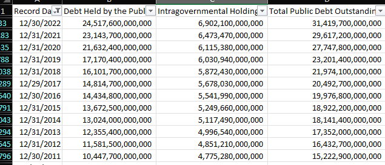

While filtering the data out some information is missing. Looking at the data Before 2001 there are areas that do not have information concerning certain areas of debt. This is something that would need to be brough the Project Manager attention or the Stakeholders to see if the information is needed for the question at hand or if the years are not needed for what they are wanting to accomplish with the information.

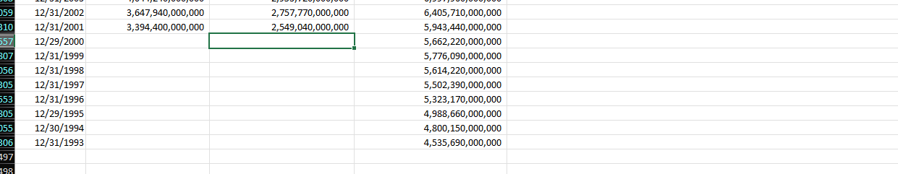

 Using =(a-b)/b*100 formula I can find the debt percentage change of one year compared to the previous year as shown in the image below.

 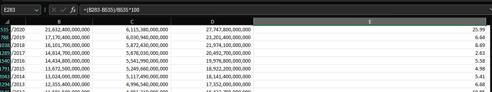

I continued the process for each column of data and then created columns with the resulting data as shown below. Now I have pulled the information I believe I need to provide charts to relay the information clearly.

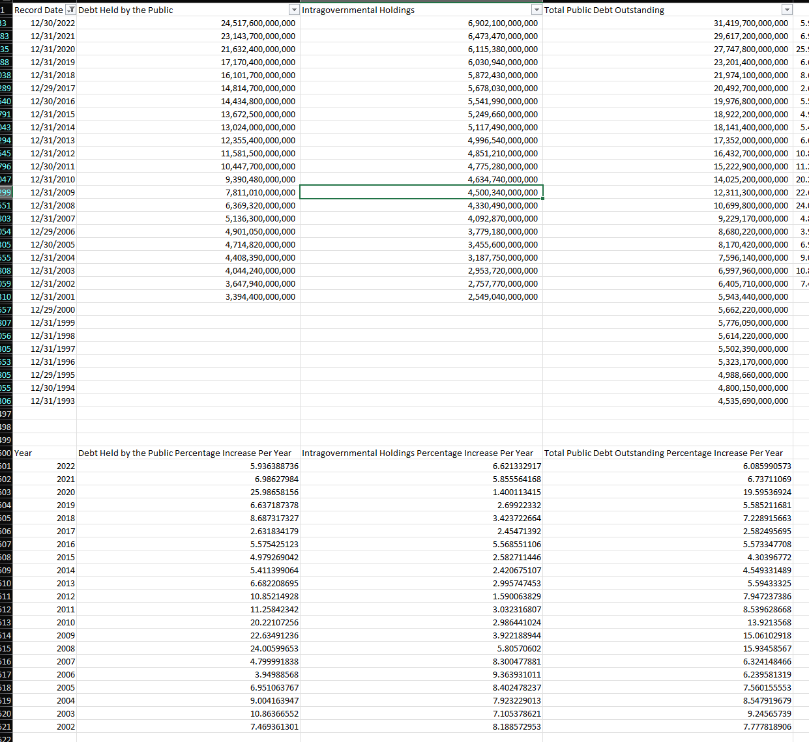

The image below shows a chart with the information we gathered.  You can see that there are two times there was a sudden increase in debt in the US. 

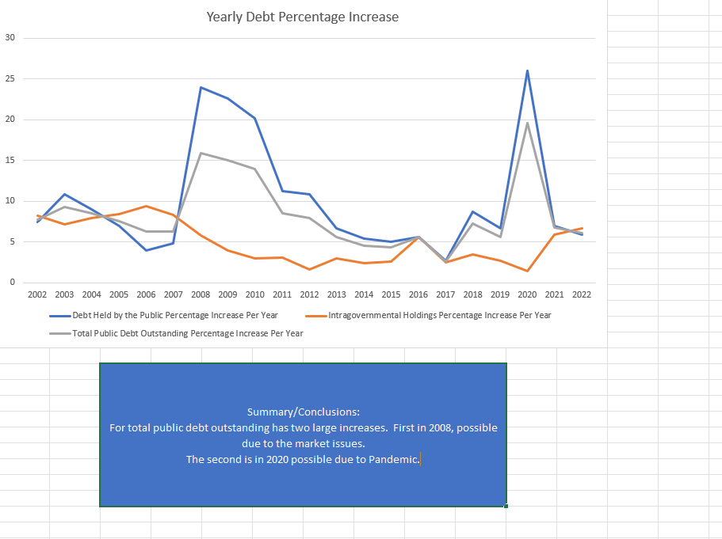

Next let us say we want to find the highest and lowest increase in total debt in our dataset.  We only need the Total Public Debt column and the information we have.  I have moved the information to a new sheet with only the information I need.  This is not necessarily needed but easier to work with.  I still have the original data if I need to go back and get anything. 

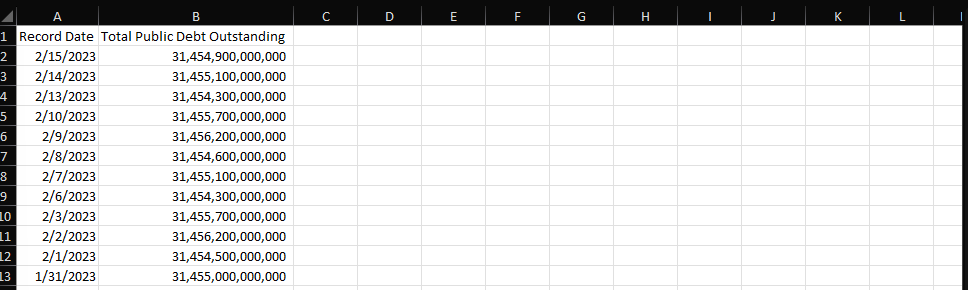

To find the average highest and lowest increase in total debt by month I want to create a pivot table and aggregate the average of the data by month as shown in the image below.

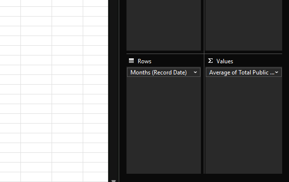

Which results in a table as below.

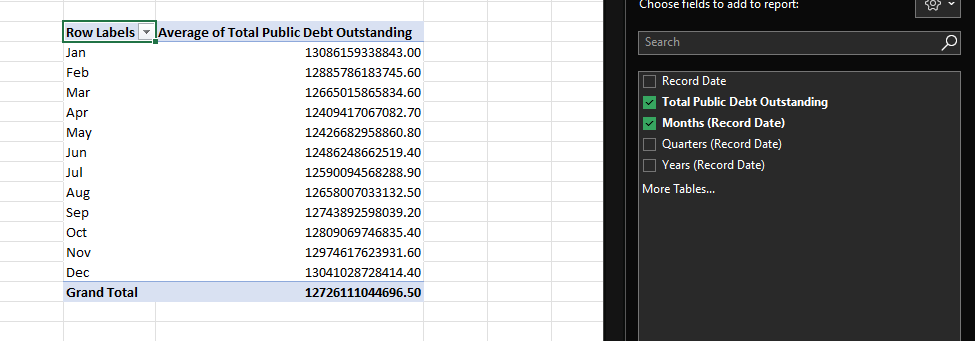

Now I am ready to make a chart that can relay the information in a clearer manner that just this table.

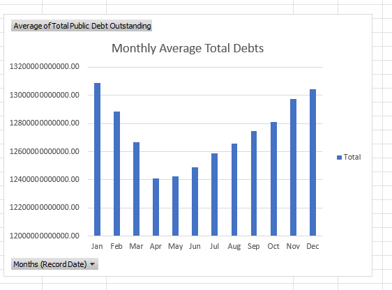

The last thing I would like to demonstrate in Excel is how to forecast with this data to see if we can get a prediction with the data we have for the following months. To achieve this, we can use the data we filtered out for the first chart we did.   We want the total for each month and that is listed on the last day of each month.

To do so I created a Pivot Table using the data and aggregated out the max debt held by the public by year shown in the image below.

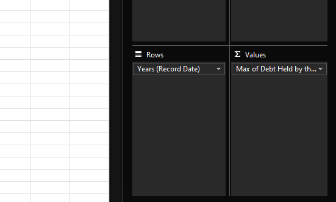

Then I pulled the data out and used the =forecasters function to forecast the next few years.

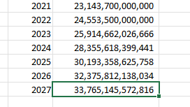

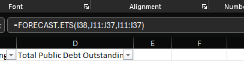

Once the data has been created, we can apply this into a chart to show the growing rate of the debt.

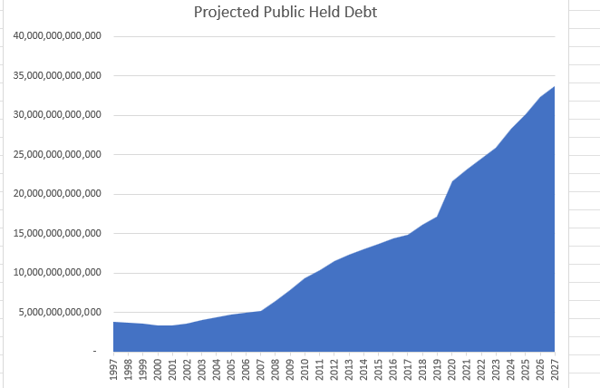
